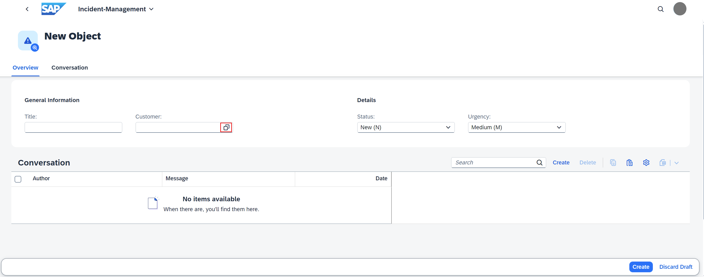

## You will learn

- How to connect to your SAP S/4HANA Cloud system.
- How to extend the existing MTA build file with the settings for SAP S/4HANA Cloud extension service.
- How to test the application with your SAP S/4HANA Cloud system.

## Prerequisites

- You have set up the connection to an SAP S/4HANA Cloud system. Follow the steps in the [Configure Connectivity Between SAP S/4HANA Cloud and SAP Business Technology Platform](remote-service-configure-connectivity) tutorial that is part of the [Consume Remote Services from S/4HANA Cloud in Your Full-Stack CAP Application Following the SAP BTP Developer's Guide and Deploy in SAP BTP, Cloud Foundry Runtime](https://developers.sap.com/group.sap-s4hana-consume-remote-services.html) tutorial group. 
- You have an [enterprise global account](https://help.sap.com/docs/btp/sap-business-technology-platform/getting-global-account#loiod61c2819034b48e68145c45c36acba6e) in SAP BTP. To use services for free, you can sign up for an SAP BTPEA (SAP BTP Enterprise Agreement) or a Pay-As-You-Go for SAP BTP global account and make use of the free tier services only. See [Using Free Service Plans](https://help.sap.com/docs/btp/sap-business-technology-platform/using-free-service-plans?version=Cloud).
- You have a platform user. See [User and Member Management](https://help.sap.com/docs/btp/sap-business-technology-platform/user-and-member-management).
- You are an administrator of the global account in SAP BTP.
- You have a subaccount in SAP BTP to deploy the services and applications.
- You have one of the following browsers that are supported for working in SAP Business Application Studio:
    - Mozilla Firefox
    - Google Chrome
    - Microsoft Edge

### Prepare the Incident Management application

First, you create a service instance for the SAP S/4HANA Cloud Extensibility service with plan `api-access`. The SAP S/4HANA Cloud system provides pre-defined communication scenarios that contain one or multiple APIs. When creating the service instance, the communication scenario needs to be specified along with some configuration. Under the hood, a communication arrangement based on the given scenario is created in the SAP S/4HANA Cloud system.

1. Create a new file **bupa.json** in the root folder of the project and paste the following code snippet in it:

    ```json
    {
        "systemName": "<SYSTEM_NAME>",
        "communicationArrangement": {
            "communicationArrangementName": "<COMM_NAME>",
            "scenarioId": "SAP_COM_0008",
            "inboundAuthentication": "BasicAuthentication",
            "outboundAuthentication": "BasicAuthentication",
            "outboundServices": [
                {
                    "name": "Replicate Customers from S/4 System to Client",
                    "isServiceActive": false
                },
                {
                    "name": "Replicate Suppliers from S/4 System to Client",
                    "isServiceActive": false
                },
                {
                    "name": "Replicate Company Addresses from S/4 System to Client",
                    "isServiceActive": false
                },
                {
                    "name": "Replicate Workplace Addresses from S/4 System to Client",
                    "isServiceActive": false
                },
                {
                    "name": "Replicate Personal Addresses from S/4 System to Client",
                    "isServiceActive": false
                },
                {
                    "name": "Business Partner - Replicate from SAP S/4HANA Cloud to Client",
                    "isServiceActive": false
                },
                {
                    "name": "Business Partner Relationship - Replicate from SAP S/4HANA Cloud to Client",
                    "isServiceActive": false
                },
                {
                    "name": "Business Partner - Send Confirmation from SAP S/4HANA Cloud to Client",
                    "isServiceActive": false
                },
                {
                    "name": "BP Relationship - Send Confirmation from SAP S/4HANA Cloud to Client",
                    "isServiceActive": false
                }
            ],
            "communicationSystem": {
                "communicationSystemHostname": "default.com",
                "outboundCommunicationUser": {
                    "username": "DefaultUser",
                    "password": "DefaultPassword"
                }
            }
        }
    }
    ```

     - For **systemName**, enter the name of your registered SAP S/4HANA Cloud system. For example, `SAP S/4HANA DEV System`.
     - For **communicationArrangementName**, enter a name for the communication arrangement that will be created for the SAP S/4HANA Cloud tenant. For example, `INCIDENT_MANAGEMENT_0008`.


    > For more information, see [Communication Arrangement JSON/YAML File - Properties](https://help.sap.com/viewer/65de2977205c403bbc107264b8eccf4b/Cloud/en-US/553a4c6b98be4c1ba7d1dfa0e9df8669.html).

2.  Navigate to the **package.json** file in the root folder of the application. Replace the settings for **API_BUSINESS_PARTNER** with the following code snippet:

    ```json[6, 7]
    "API_BUSINESS_PARTNER": {
        "kind": "odata-v2",
        "model": "srv/external/API_BUSINESS_PARTNER",
        "[production]": {
            "credentials": {
                "destination": "incidents-api-access",
                "path": "/sap/opu/odata/sap/API_BUSINESS_PARTNER"
            }
        }
    }
    ```
    <!-- If you are deploying to Cloud Foundry, the **destination** is `incidents-api-access`. For Kyma, the **destination** is `incident-management-s4-hana-cloud`. -->


2. Open the **mta.yml** file and add the following code snippet to the **resource** section:

    ```yaml
    - name: incidents-api-access
      type: org.cloudfoundry.managed-service  
      parameters:
        path: ./bupa.json
        service: s4-hana-cloud
        service-plan: api-access
        system-name: <system-name>
    ```

    > For **system-name**, enter the name of your registered SAP S/4HANA Cloud system. For example, `SAP S/4HANA DEV System`.

4. In the **mta.yml** file, make sure that the following line is added to the **requires** section of the **incident-management-srv** module:
   
    ```yaml[7]
    - name: incident-management-srv
      type: nodejs
      path: gen/srv
      requires:
      - name: incident-management-auth
      - name: incident-management-db
      - name: incident-management-destination-service
    ....
    ```


### Deploy the application

4. Log in to your subaccount in SAP BTP:

    ```bash
    cf api <API-ENDPOINT>
    cf login
    cf target -o <ORG> -s <SPACE>
    ```

    > You can find the API endpoint in the **Overview** section of your subaccount in the SAP BTP cockpit.

5. Run the following commands to build and deploy your project in the SAP BTP, Cloud Foundry runtime:

    ```bash
    mbt build
    cf deploy mta_archives/incident-management_1.0.0.mtar 
    ```
   

### Test the Incident Management application

When creating new entries in the Incident Management application, you should be able to see all values from your SAP S/4HANA Cloud system in the value help of the **Customer** field.

> Before you continue with this step, don’t forget to perform the steps from the tutorials [Assign the User Roles](https://developers.sap.com/tutorials/user-role-assignment.html) and [Integrate Your Application with SAP Build Work Zone, Standard Edition](https://developers.sap.com/tutorials/integrate-with-work-zone.html).

1. Open your SAP Build Work Zone, standard edition site as described in [Integrate Your Application with SAP Build Work Zone, Standard Edition](https://developers.sap.com/tutorials/integrate-with-work-zone.html).

6. Choose the Incident Management tile.

    <!-- border; size:540px --> 

9. Choose **Create** to start creating a new incident.
  
    <!-- border; size:540px --> 

11. Open the value help for the **Customer** field. 

    <!-- border; size:540px --> 

12. Verify that customer data is fetched from the mock server. 

    <!-- border; size:540px --> 


Congratulations! You have successfully developed, configured, and deployed the Incident Management application using an external service and an SAP S/4HANA Cloud system.