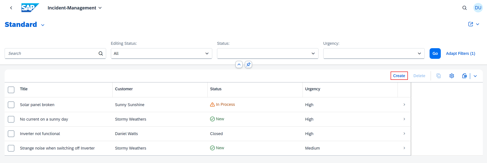
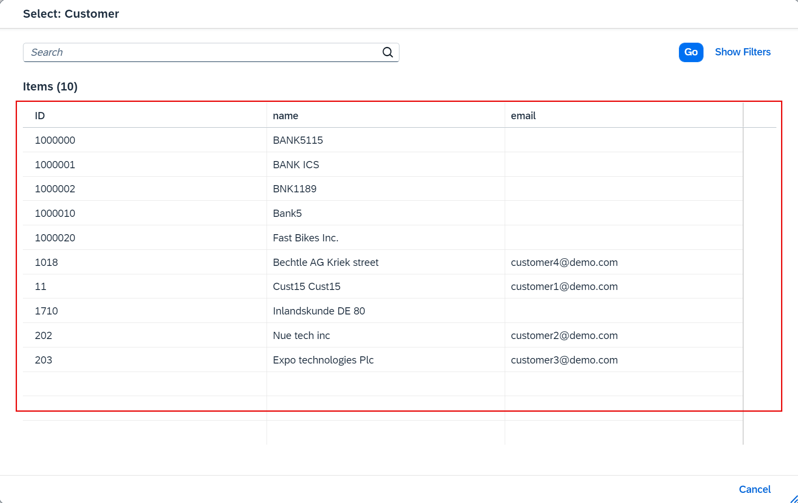

## You will learn

- How to deploy and the Incident Management application in the SAP BTP, Kyma runtime.
- How to test the application with the mock server that you have installed.

## Prerequisites

- You have tested the extended Incident Management sample application. Follow the steps in the [Test the Extended Incident Management Application with the Business Partner API](remote-service-run-dev-test) tutorial that is part of the [Consume Remote Services from a Mock Server in Your Full-Stack CAP Application Following the SAP BTP Developer's Guide and Deploy in SAP BTP, Kyma Runtime](link-to-new-group-goes-here) tutorial group.
- You have installed a mock server in your namespace in the SAP BTP, Kyma runtime. Follow the steps in the [Install a Mock Server in the SAP BTP, Cloud Foundry Runtime](remote-service-set-up-mock) tutorial that is part of the [Consume Remote Services from a Mock Server in Your Full-Stack CAP Application Following the SAP BTP Developer's Guide and Deploy in SAP BTP, Kyma Runtime](link-to-new-group-goes-here) tutorial group.
- You have an [enterprise global account](https://help.sap.com/docs/btp/sap-business-technology-platform/getting-global-account#loiod61c2819034b48e68145c45c36acba6e) in SAP BTP. To use services for free, you can sign up for an SAP BTPEA (SAP BTP Enterprise Agreement) or a Pay-As-You-Go for SAP BTP global account and make use of the free tier services only. See [Using Free Service Plans](https://help.sap.com/docs/btp/sap-business-technology-platform/using-free-service-plans?version=Cloud).
- You have a platform user. See [User and Member Management](https://help.sap.com/docs/btp/sap-business-technology-platform/user-and-member-management).
- You are an administrator of the global account in SAP BTP.
- You have a subaccount in SAP BTP to deploy the services and applications.

> This tutorial follows the guidance provided in the [SAP BTP Developer's Guide](https://help.sap.com/docs/btp/btp-developers-guide/what-is-btp-developers-guide).

### Build images

>- Make sure you're logged in to your Kyma cluster. See [Login to your Kyma cluster](https://developers.sap.com/tutorials/deploy-to-kyma.html#a6e029c1-6e72-408b-bf5f-3b9dffba3499) for detailed steps how to log in.
>
>- Make sure you're logged in to your container registry.
>
>- If you're using any device with a non-x86 processor (e.g. MacBook M1/M2) you need to instruct Docker to use x86 images by setting the **DOCKER_DEFAULT_PLATFORM** environment variable using the command `export DOCKER_DEFAULT_PLATFORM=linux/amd64`. Check [Environment variables](https://docs.docker.com/engine/reference/commandline/cli/#environment-variables) for more info.


1. In VS Code, open the **package.json** file and add the following snippet to it:

    ```json[4-9]
      "API_BUSINESS_PARTNER": {
        "kind": "odata", 
        "model": "srv/external/API_BUSINESS_PARTNER", 
        "[production]": { 
          "credentials": { 
            "destination": "<destination_name>",
            "path": "odata/v2/api-business-partner"
          }
        }
      }
    ```

    > Replace **<destination_name>** with the name of the destination that you created at **Step 5: Create a destination to the mock server** of [Install a Mock Server in the SAP BTP, Kyma Runtime](remote-service-set-up-mock-kyma).


3. Create the productive CAP build for your application: 

    ```bash
    cds build --production
    ```

    The CAP build writes to the **gen/srv** folder.

4. Build a new version of the CAP Node.js image:

    ```bash
    pack build <your-container-registry>/incident-management-srv:<new-image-version> \
        --path gen/srv \
        --builder paketobuildpacks/builder-jammy-base \
        --publish
    ```

    >- Make sure to replace `<your-container-registry>` with your docker server URL. 
    > 
    >- Keep in mind that `<new-image-version>` should be a string that is different from the string defined in [Deploy in SAP BTP, Kyma Runtime](deploy-to-kyma) to reflect the changes in the Incident Management app. 

    > Looking for your docker server URL?
    
    > The docker server URL is the same as the path used for docker login, so you can quickly check it by running the following command in your terminal:

    > ```json
    > cat ~/.docker/config.json
    > ```

    > In case you're using Docker Hub as your container registry, replace the placeholder `<your-container-registry>` with your Docker Hub user ID.

    > The pack CLI builds the image that contains the build result in the **gen/srv** folder and the required npm packages by using the [Cloud Native Buildpack for Node.JS](https://github.com/paketo-buildpacks/nodejs) provided by Paketo.


7. In the VS Code terminal, navigate to the **ui-resources** folder and run the following command:

    ```bash
    npm install && npm run package
    ```

    This will build and copy the archive **nsincidents.zip** inside the **ui-resources/resources** folder.

8. In the VS Code terminal, navigate back to the root folder of your project:

    ```bash
    cd ..
    ```

9. Build the UI deployer image:

    ```bash
    pack build <your-container-registry>/incident-management-html5-deployer:<image-version> \
        --path ui-resources \
        --builder paketobuildpacks/builder-jammy-base \
        --publish
    ```

    > Make sure to replace `<your-container-registry>` with the link to your container registry and keep in mind that `<image-version>` should be a string. 
    
    > Looking for your docker server URL?
    
    > The docker server URL is the same as the path used for docker login, so you can quickly check it by running the following command in your terminal:

    > ```json
    > cat ~/.docker/config.json
    > ```

    > In case you're using Docker Hub as your container registry, replace the placeholder `<your-container-registry>` with your Docker Hub user ID.

You haven't made any changes to the database image so you don't need to build it again.

### Deploy the Incident Management application

1. Check your container image settings to your **chart/values.yaml** file:

    ```yaml[6,7]
    global:
      domain: 
      imagePullSecret:
        name: 
      image:
        registry: <your-container-registry>
        tag: <image-version>
    ```

    > Make sure to replace `<your-container-registry>` with the link to your container registry and keep in mind that `<image version>` should be a string. 


2. Overwrite the global image version for the CAP Node.js image:
    
    ```yaml[4]
    srv:
      image:
        repository: incident-management-srv
        tag: <new-image-version>
    ```

1. Update the productive CAP build for your application: 

    ```bash
    cds build --production
    ```

3. Make sure your SAP HANA Cloud instance is running. Free tier HANA instances are stopped overnight.

    > Your SAP HANA Cloud service instance will be automatically stopped overnight, according to the server region time zone. That means you need to restart your instance every day before you start working with it.
    >
    > You can either use SAP BTP cockpit or the terminal in the SAP Business Application Studio to restart the stopped instance:
    >
    > ```bash
    > cf update-service incident-management -c '{"data":{"serviceStopped":false}}'
    > ```

3. Deploy using the Helm command:

    ```bash
    helm upgrade --install incident-management --namespace incident-management ./gen/chart \
    --set-file xsuaa.jsonParameters=xs-security.json
    ```

    This installs the Helm chart from the **chart** folder with the release name **incident-management** in the namespace **incident-management**.

### Test the Incident Management application

When creating new entries in the Incident Management application, you should be able to see all values from the mock server in the value help of the **Customer** field.

> Before you continue with this step, don’t forget to perform the steps from the tutorials [Assign the User Roles](https://developers.sap.com/tutorials/user-role-assignment.html) and [Integrate Your Application Deployed in SAP BTP, Kyma Runtime with SAP Build Work Zone, Standard Edition](https://developers.sap.com/tutorials/integrate-with-work-zone-kymaruntime.html).

1. Open your SAP Build Work Zone, standard edition site as described in [Integrate Your Application Deployed in SAP BTP, Kyma Runtime with SAP Build Work Zone, Standard Edition](https://developers.sap.com/tutorials/integrate-with-work-zone-kymaruntime.html).

6. Choose the **Incident Management** tile.

    <!-- border; size:540px --> 

9. Choose **Create** to start creating a new incident.
  
    <!-- border; size:540px --> 

11. Open the value help for the **Customer** field. 

    <!-- border; size:540px --> 

12. Verify that customer data is fetched from the mock server. 

    <!-- border; size:540px --> 

Congratulations! You have successfully developed, configured, and deployed the Incident Management application using an external service and a mock server.
